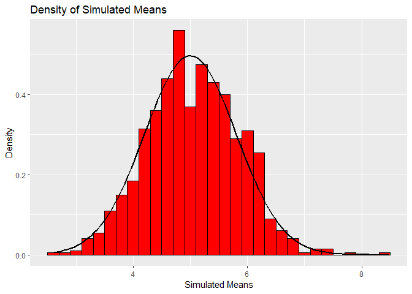

##Overview

The purpose of the project is to investigate the exponential distribution and compare it with the Central Limit Theorem. The exponential distribution can be simulated in R with rexp(n, lambda) where lambda is the rate parameter. The mean of the exponential distribution is 1/lambda and the standard deviation is also 1/lambda. Lambda will be set at 0.2 for all simulations. The investigation will compare the distribution of averages of 40 exponentials over 1,000 simulations.

##The Simulations

We set the variables for the simulations as follows:


```r
set.seed(108)
n<-40
lambda<-0.2
sims<-1000
```

Perform the simulations using the variables as follows:


```r
means = NULL
for (i in 1:sims) {
    means = c(means, mean(rexp(n, lambda)))
}
```

##Sample Mean vs. Theoretical Mean

###Sample Mean
Calculate the sample mean from the simulations.


```r
samMean<-mean(means)
```

###Theoretical Mean
Calculate the theoretical mean.


```r
theoMean<-1/lambda

meanComp<-samMean-theoMean
```

###Comparison
The sample mean of 5.0581079 versus the theoretical mean of 5 for a difference of 0.0581079.

##Sample Variance vs. Theoretical Variance

###Sample Variance
Calculate the sample variance from the simulations.


```r
samVar<-var(means)
```

###Theoretical Variance
Calculate the theoretical variance.


```r
theoVar<-(1/lambda)^2/n

varComp<-samVar-theoVar
```

###Comparison
The sample variance of 0.6435606 versus the theoretical variance of 0.625 for a difference of 0.0185606.

##Distribution

The following is a density histogram of the simulated means. The density histogram has an overlay of a normal distribution with mean of 1/lambda and standard deviation of (1/lambda)*sqrt(n).


```r
library(ggplot2)
```

```
## Warning: package 'ggplot2' was built under R version 3.5.2
```

```r
df<-data.frame(means)
ggplot(df, aes(x = means)) + geom_histogram(aes(y = ..density..), binwidth = 0.2, fill = "red", color = "black") + stat_function(geom = "line", fun = dnorm, args = list(mean = theoMean, sd = sd(means)), size = 1) + labs(x = "Simulated Means", y = "Density", title = "Density of Simulated Means")
```

<!-- -->
