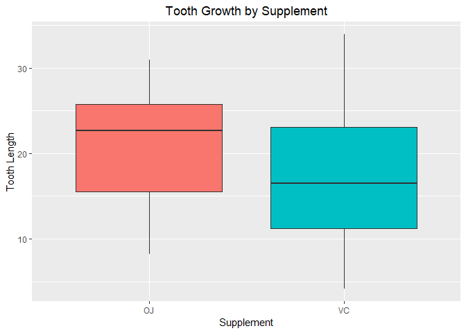
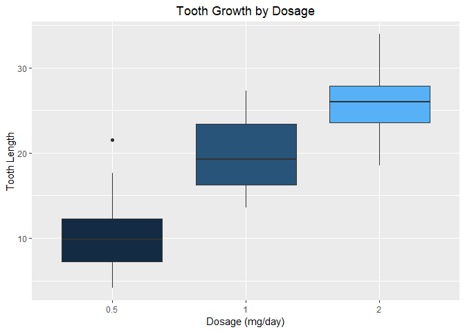
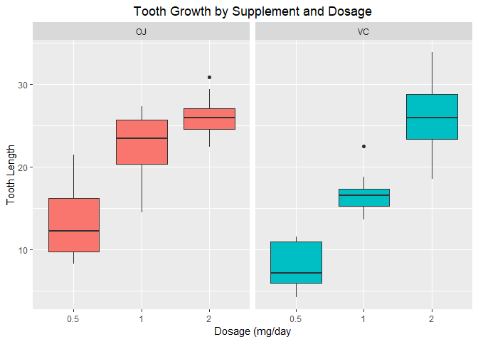

##Overview

The purpose of this project is to analyze the ToothGrowth dataset. ToothGrowth data set contains the result from an experiment studying the effect of vitamin C on tooth growth in 60 Guinea pigs. Each animal received one of three dose levels of vitamin C (0.5, 1, and 2 mg/day) by one of two delivery methods, (orange juice or ascorbic acid (a form of vitamin C and coded as VC).

##Exploratory Data Analysis

We will begin the analysis by loading the dataset and performing some exploratory analysis.


```r
library(datasets)
data("ToothGrowth")
str(ToothGrowth)
```

```
## 'data.frame':	60 obs. of  3 variables:
##  $ len : num  4.2 11.5 7.3 5.8 6.4 10 11.2 11.2 5.2 7 ...
##  $ supp: Factor w/ 2 levels "OJ","VC": 2 2 2 2 2 2 2 2 2 2 ...
##  $ dose: num  0.5 0.5 0.5 0.5 0.5 0.5 0.5 0.5 0.5 0.5 ...
```

```r
head(ToothGrowth)
```

```
##    len supp dose
## 1  4.2   VC  0.5
## 2 11.5   VC  0.5
## 3  7.3   VC  0.5
## 4  5.8   VC  0.5
## 5  6.4   VC  0.5
## 6 10.0   VC  0.5
```

```r
summary(ToothGrowth)
```

```
##       len        supp         dose      
##  Min.   : 4.20   OJ:30   Min.   :0.500  
##  1st Qu.:13.07   VC:30   1st Qu.:0.500  
##  Median :19.25           Median :1.000  
##  Mean   :18.81           Mean   :1.167  
##  3rd Qu.:25.27           3rd Qu.:2.000  
##  Max.   :33.90           Max.   :2.000
```

View the data graphically to begin drawing conclusions about the relationships between the data.


```r
library(ggplot2)
```

```
## Warning: package 'ggplot2' was built under R version 3.5.2
```

```r
ggplot(data = ToothGrowth, aes(supp, len)) + geom_boxplot(aes(fill = supp), show.legend = FALSE) + labs(title = "Tooth Growth by Supplement", x = "Supplement", y = "Tooth Length") + theme(plot.title = element_text(hjust = 0.5))
```

<!-- -->

```r
ggplot(data = ToothGrowth, aes(factor(dose), len)) + geom_boxplot(aes(fill = dose), show.legend = FALSE) + labs(title = "Tooth Growth by Dosage", x = "Dosage (mg/day)", y = "Tooth Length") + theme(plot.title = element_text(hjust = 0.5))
```

<!-- -->

```r
ggplot(data = ToothGrowth, aes(factor(dose), len)) + facet_grid(.~supp) + geom_boxplot(aes(fill = supp), show.legend = FALSE) + labs(title = "Tooth Growth by Supplement and Dosage", x = "Dosage (mg/day", y = "Tooth Length") + theme(plot.title = element_text(hjust = 0.5))
```

<!-- -->

The preliminary analysis seems to show that at higher dosages, 2 milligrams per day, both orange juice and ascorbic acid increase tooth growth. At lower dosages, 0.5 to 1 milligrams per day, orange juice appears to be more effective at promoting tooth growth. The preliminary anaysis seems to suggest that the use of orange juice promotes tooth growth.

##Confidence Intervals and Hypothesis Testing

###Hypothesis 1
Orange juice and ascorbic acid are equally effective at promoting tooth growth.


```r
t.test(len~supp, data = ToothGrowth)
```

```
## 
## 	Welch Two Sample t-test
## 
## data:  len by supp
## t = 1.9153, df = 55.309, p-value = 0.06063
## alternative hypothesis: true difference in means is not equal to 0
## 95 percent confidence interval:
##  -0.1710156  7.5710156
## sample estimates:
## mean in group OJ mean in group VC 
##         20.66333         16.96333
```

The p-value of 0.06 is greater than the threshhold of 0.05. Additionally, the 95% confidence interval contains zero. The null hypothesis cannot be rejected.

###Hypothesis 2
The dosages are equally effective at promoting tooth growth.


```r
t.test(len~dose, data = subset(ToothGrowth, dose == c(0.5, 1)))
```

```
## 
## 	Welch Two Sample t-test
## 
## data:  len by dose
## t = -4.4725, df = 17.976, p-value = 0.0002952
## alternative hypothesis: true difference in means is not equal to 0
## 95 percent confidence interval:
##  -14.43327  -5.20673
## sample estimates:
## mean in group 0.5   mean in group 1 
##             10.63             20.45
```

```r
t.test(len~dose, data = subset(ToothGrowth, dose == c(0.5, 2)))
```

```
## 
## 	Welch Two Sample t-test
## 
## data:  len by dose
## t = -7.3335, df = 17.635, p-value = 9.362e-07
## alternative hypothesis: true difference in means is not equal to 0
## 95 percent confidence interval:
##  -19.72833 -10.93167
## sample estimates:
## mean in group 0.5   mean in group 2 
##             10.63             25.96
```

```r
t.test(len~dose, data = subset(ToothGrowth, dose == c(1, 2)))
```

```
## 
## 	Welch Two Sample t-test
## 
## data:  len by dose
## t = -3.6827, df = 17.949, p-value = 0.00171
## alternative hypothesis: true difference in means is not equal to 0
## 95 percent confidence interval:
##  -10.899993  -2.980007
## sample estimates:
## mean in group 1 mean in group 2 
##           19.02           25.96
```

The p-values of each test are less than the threshhold of 0.05. Additionally, the 95% confidence intervals for each test do not contain zero. The null hypothesis is rejected.

##Conclusion

Given the following assumptions:

    1. The sample is representative of the population.
    2. Normal distribution of tooth lengths.

Based on the analysis, we conclude that the type of supplement has no effect on tooth growth. However, increased dosages promote tooth growth using either supplement.
